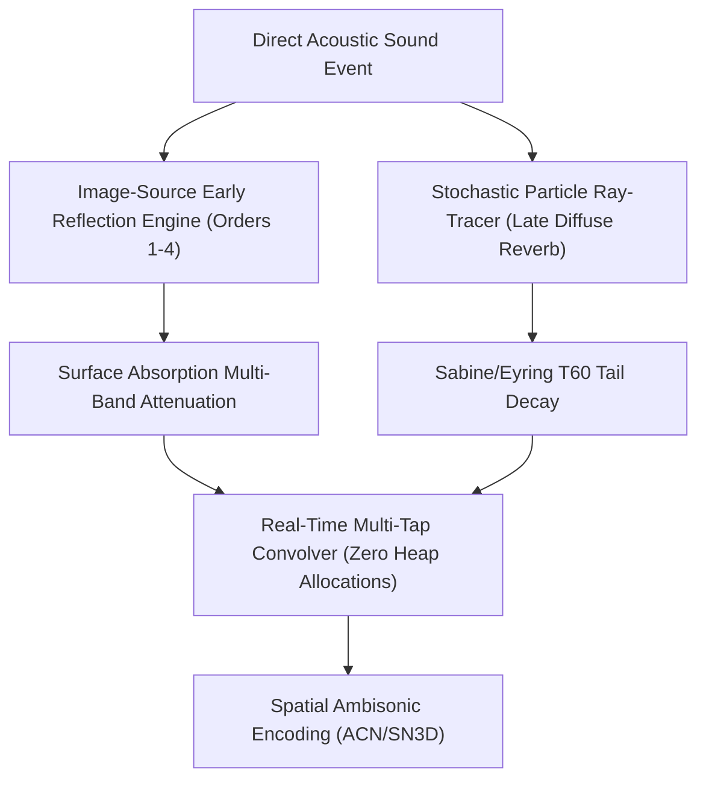

# Edge Spatial Audio DSP, Physical Mesh Reverberation & Immersive Sound Specification

## 1. Physical 3D Room Acoustics & Image-Source Modeling

`RainAI` models indoor and outdoor acoustic spaces using a dual-engine architecture:
1. **Deterministic Image-Source Model (ISM)**: Computes specular early reflections up to 4th order.
2. **Stochastic Particle Ray-Tracing**: Simulates diffuse late reverberation and energy decay matching Sabine and Eyring reverberation time formulas.



### 1.1 Image-Source Reflection Dynamics

For a shoebox room $[0, W] \times [0, L] \times [0, H]$ with source $\mathbf{s} = (x_s, y_s, z_s)$ and listener $\mathbf{l} = (x_l, y_l, z_l)$, image sources are located at lattice coordinates:

$$\mathbf{x}_i(n_x, n_y, n_z, p_x, p_y, p_z) = \begin{pmatrix} 2 n_x W + (-1)^{p_x} x_s \\ 2 n_y L + (-1)^{p_y} y_s \\ 2 n_z H + (-1)^{p_z} z_s \end{pmatrix}, \quad p_x, p_y, p_z \in \{0, 1\}$$

For each image source up to reflection order $|n_x| + |n_y| + |n_z| \le N$:
- Propagation distance: $d = \|\mathbf{x}_i - \mathbf{l}\|$
- Arrival delay: $\tau = d / c$ ($c = 343.0\text{ m/s}$)
- Energy attenuation: $g = \frac{1}{\max(d, 1.0)} \prod_{k=1}^{\text{order}} (1 - \alpha_k)^{1/2}$

### 1.2 Surface Material Properties

Absorption coefficients across standard octave bands (125 Hz to 4 kHz):

| Material | 125 Hz | 250 Hz | 500 Hz | 1 kHz | 2 kHz | 4 kHz | Mean $\bar{\alpha}$ | Scattering $s$ |
| :--- | :--- | :--- | :--- | :--- | :--- | :--- | :--- | :--- |
| **Glass** | 0.04 | 0.04 | 0.03 | 0.03 | 0.02 | 0.02 | 0.03 | 0.05 |
| **Pine Timber** | 0.10 | 0.11 | 0.10 | 0.08 | 0.08 | 0.11 | 0.10 | 0.20 |
| **Concrete** | 0.01 | 0.01 | 0.02 | 0.02 | 0.02 | 0.03 | 0.02 | 0.25 |
| **Sheet Metal** | 0.06 | 0.05 | 0.04 | 0.04 | 0.03 | 0.02 | 0.04 | 0.05 |
| **Fabric** | 0.14 | 0.35 | 0.55 | 0.72 | 0.70 | 0.65 | 0.52 | 0.55 |
| **Plasterboard** | 0.29 | 0.10 | 0.05 | 0.04 | 0.07 | 0.09 | 0.11 | 0.10 |
| **Brick** | 0.03 | 0.03 | 0.03 | 0.04 | 0.05 | 0.07 | 0.04 | 0.40 |

---

## 2. Higher-Order Ambisonics (HOA) & ITU 7.1.4 Immersive Decoders

### 2.1 3rd-Order Spherical Harmonics (16 Channels)

RainAI encodes point audio sources into 3rd-order Ambisonics using the **Ambisonic Channel Number (ACN)** ordering and **Schmidt Semi-Normalized (SN3D)** convention ($N = (l+1)^2 = 16$ channels):

$$\begin{aligned}
\text{Order 0}: \quad & A_0 = 1 \\
\text{Order 1}: \quad & A_1 = \sin\theta\cos\phi \ (Y), \quad A_2 = \sin\phi \ (Z), \quad A_3 = \cos\theta\cos\phi \ (X) \\
\text{Order 2}: \quad & A_4 = \frac{\sqrt{3}}{2} \sin(2\theta)\cos^2\phi \ (V), \quad A_5 = \frac{\sqrt{3}}{2} \sin\theta\sin(2\phi) \ (T), \quad A_6 = \frac{1}{2}(3\sin^2\phi - 1) \ (R), \\
& A_7 = \frac{\sqrt{3}}{2} \cos\theta\sin(2\phi) \ (S), \quad A_8 = \frac{\sqrt{3}}{2} \cos(2\theta)\cos^2\phi \ (U) \\
\text{Order 3}: \quad & A_9 \dots A_{15} \quad (\text{Heptad of degree 3 harmonics})
\end{aligned}$$

### 2.2 ITU 7.1.4 Loudspeaker Layout Decoding

Decodes 16-channel HOA into a 12-channel immersive surround configuration according to ITU-R BS.2051:

```
                  [Center] (0°)
      [Left] (-30°)        [Right] (+30°)
      [Top-Front-L]        [Top-Front-R]
            \                    /
             \      [Listener]  /
             /                  \
      [Top-Back-L]         [Top-Back-R]
[Left-Side] (-90°)              [Right-Side] (+90°)
      [Left-Rear] (-150°)  [Right-Rear] (+150°)
                  [LFE Subwoofer]
```

---

## 3. Real-Time Safety & Zero-Allocation Constraints

All components operating in the audio stream render callback strictly adhere to:
1. **Zero Heap Allocations**: Circular ring buffers, FIR filter kernels, and delay tap arrays are pre-allocated at initialization or resized strictly on the control thread.
2. **Deterministic Latency**: Callback execution budget is bounded to $< 2.6\text{ ms}$ at 128 frames / 48 kHz.
3. **Lock-Free Parameter Synchronization**: Room parameters, head rotations, and RLS recommendations are updated via atomic swaps and lock-free queues.
